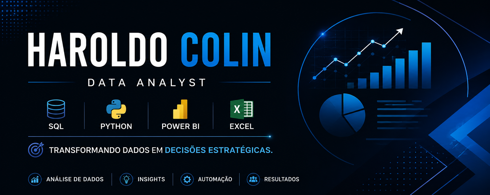

  

<b>📊 Analista de Dados | Business Intelligence | SQL | Python | Power BI</b>

Sou formado em Análise e Desenvolvimento de Sistemas e estou em transição para a área de Análise de Dados, unindo mais de 20 anos de experiência profissional em gestão, liderança de equipes, análise de indicadores e melhoria de processos com conhecimentos em Business Intelligence e análise de dados.

Minha missão é transformar dados em informações estratégicas que apoiem a tomada de decisões e gerem valor para as empresas.

🚀 Tecnologias
🗄️ SQL (MySQL, PostgreSQL, Oracle e T-SQL)
🐍 Python
📊 Power BI
📈 Excel
⚡ DAX
🔄 Power Query
🏗️ Modelagem de Dados
🌿 Git & GitHub
📚 Atualmente estudando
Análise de Dados
Business Intelligence
ETL
Visualização de Dados
Python para Ciência de Dados
SQL Avançado
Git e GitHub
📂 Projetos em destaque

Neste GitHub você encontrará projetos voltados para problemas reais de negócio, incluindo:

📊 Dashboards interativos em Power BI
📈 Análise de indicadores (KPIs)
🗄️ Consultas SQL
🐍 Scripts em Python para tratamento e análise de dados
🔄 Projetos de ETL
📋 Modelagem de Dados
📉 Business Intelligence
💼 Minha experiência

Minha trajetória profissional foi construída em funções de liderança, gestão operacional e melhoria de processos, desenvolvendo competências como:

Gestão de equipes
Planejamento estratégico
Acompanhamento de indicadores
Elaboração de relatórios gerenciais
Análise de desempenho
Otimização de processos
Tomada de decisão baseada em dados

Hoje direciono toda essa experiência para a área de Dados, combinando visão de negócio com tecnologia.

🎯 Objetivo

Busco oportunidades como:

Analista de Dados
Analista de BI
Analista de Indicadores
Analista de Business Intelligence

Meu objetivo é desenvolver soluções que transformem dados em informações estratégicas para apoiar decisões e impulsionar resultados.

📫 Vamos nos conectar
💼 LinkedIn: www.linkedin.com/in/haroldocolin
📧 Em breve novos projetos serão publicados neste perfil.

⭐ Obrigado pela visita! Fique à vontade para explorar meus projetos e acompanhar minha evolução na área de Dados.
